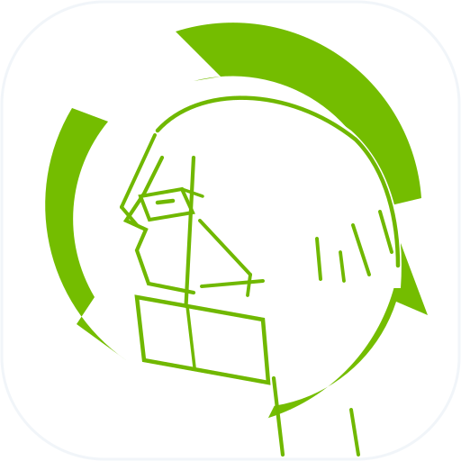

# PodFlow 🎙️

[](https://github.com/yulaoshizuikeai/InkCast-Android/actions/workflows/android-ci.yml)
-brightgreen)
-purple)


**PodFlow** 是一款现代、独立、纯粹的原生 Android RSS 播客播放器。采用最新 Jetpack Compose Material 3 沉浸式设计与 AndroidX Media3 音频架构，支持任意标准 RSS 订阅、全景音频波形光环视觉设计、边听边存离线流媒体缓存与智能睡眠定时器。

<div align="center">
  
  <p><em>全景音频波形光环 • 纯粹流动的 RSS 播客之声</em></p>
</div>

---

## ✨ 核心特性

- 🎙️ **独立通用 RSS 播客订阅**：内置极速 XML Pull 解析引擎与重试机制，支持输入播客名称、RSS 订阅链接或音频直链，畅享完全自主掌控的去中心化播客体验。
- 🎨 **全新全景波形光环设计**：以 360° 动态全景音频声波光环（Panoramic Audio Waveform Ring）与流线 Play 核心构筑专属 SVG 矢量标识，全面支持 Android Adaptive Icon 规范与 Material 3 动态色彩。
- 📦 **双轨离线与流媒体缓存 (Offline-First)**：
  - **节目元数据 SWR 缓存**：断网状态秒级拉取已缓存的播客列表与节目详情。
  - **Media3 音频流边听边存**：基于 `SimpleCache` + 500MB LRU 智能淘汰，拖拽快退与重听不耗费额外流量，支持一键单集后台下载。
- ⏱️ **智能睡眠定时器 (Sleep Timer)**：
  - 预设 15 / 30 / 45 / 60 分钟倒计时，息屏及后台稳定生效。
  - 专设“播完当前单集”模式，本集收听完毕即刻自动静音暂停。
- ⚡ **智能流媒体加速代理**：深度整合 Cloudflare Worker 流代理（`podcast.yunet.cfd`），原生支持 HTTP Range 局部请求、毫秒级拖拽快进与断点续传。
- 🎵 **现代化音频中枢**：基于 **AndroidX Media3 (ExoPlayer + MediaSession)** 实现，支持前台常驻通知、锁屏线控与 0.5x~3.0x 无极倍速调节。

---

## 🚀 云端构建流程 (CI / CD)

本项目配置了完整的 GitHub Actions 自动化持续集成与交付流水线，支持代码质量检测、单元测试、多渠道 APK 打包及版本发布。

### 1. 触发机制
| 触发事件 | 触发条件 | 执行任务 |
| :--- | :--- | :--- |
| **代码推送 (`Push`)** | 推送至 `main` 分支 | 运行单元测试、打包 Debug & Release APK 并上传工件 |
| **拉取请求 (`PR`)** | 目标为 `main` 分支 | 自动化代码校验与测试，保障分支质量 |
| **手动触发 (`workflow_dispatch`)** | GitHub Actions 页面手动点击 | 可自由选择构建目标（`all` / `debug` / `release`） |
| **版本发布 (`Tag`)** | 推送 `v*` 标签（如 `v2.1.0`） | 自动创建 GitHub Release 并附带各构型 APK 安装包 |

### 2. 下载构建产物 (APK)
1. 访问本仓库的 **[Actions](https://github.com/yulaoshizuikeai/InkCast-Android/actions)** 页面。
2. 点击最近一次成功的 Workflow 记录。
3. 在页面底部的 **Artifacts (工件)** 区域，即可直接下载打包好的 APK 安装包。

---

## 🛠️ 本地开发与构建

### 环境要求
- **JDK**: Java 17 (推荐 Temurin 17)
- **Gradle**: 8.13 (已随仓库自带 Gradle Wrapper)
- **Android SDK**: Compile SDK 35, Min SDK 26

### 常用命令
```bash
# 运行单元测试
./gradlew testDebugUnitTest

# 编译生成 Debug 安装包
./gradlew assembleDebug

# 编译生成 Release 安装包
./gradlew assembleRelease
```
编译产物位于 `app/build/outputs/apk/` 目录下。

---

## 🌐 架构与配套服务

```
PodFlow-Android (Compose + Media3)
       │
       ▼ (智能分流)
  ┌───────────────┴────────────────┐
  │ 国内源直连                     │ 海外源加速
  ▼                                ▼
各主流播客平台 CDN          Cloudflare Worker (`podcast.yunet.cfd`)
                                  │
                                  ▼
                        全球 Anycast 边缘流式代理
```

配套 Cloudflare Worker 代理代码位于 [`cloudflare-worker/`](file:///c:/Users/Yu_233/Documents/antigravity/cool-bohr/cloudflare-worker)。

---

## 📄 开源许可证

本项目基于 [MIT License](LICENSE) 开源。
